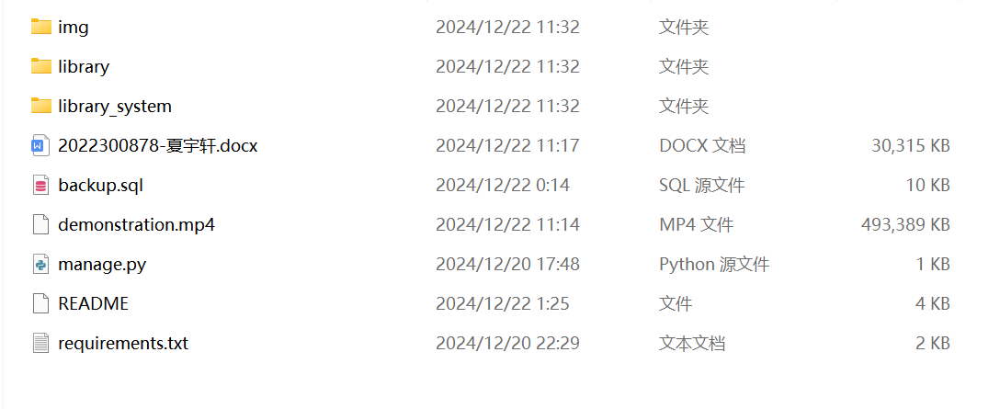
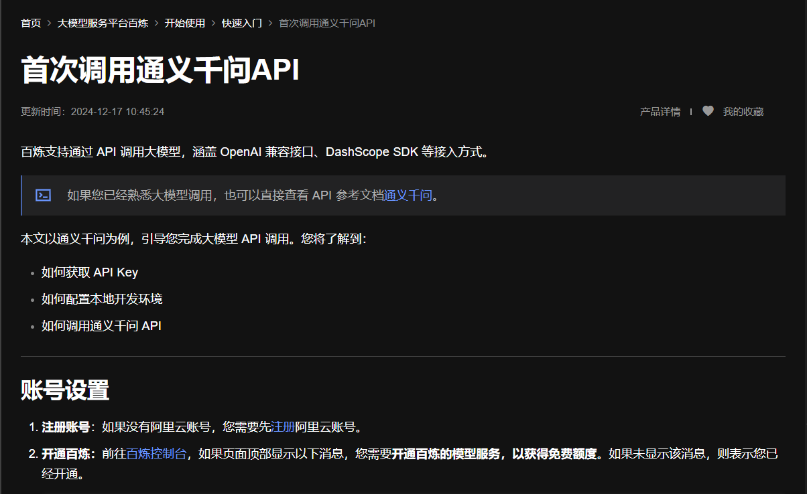
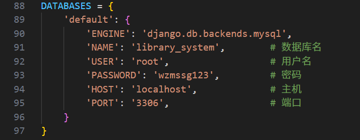
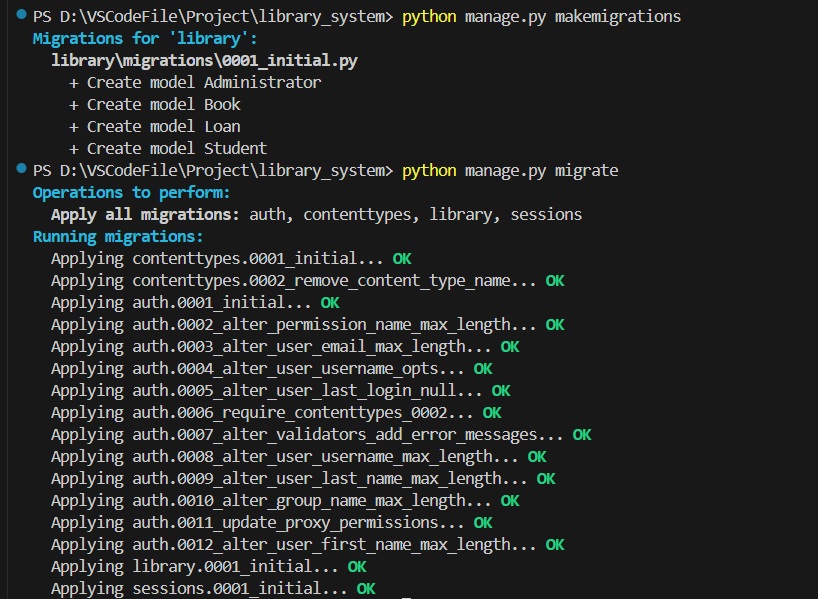
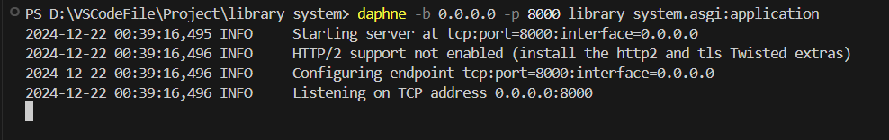
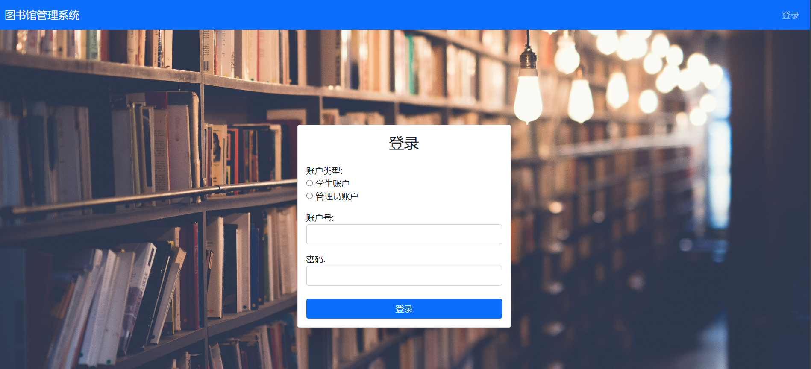

## 图书馆管理系统

本项目基于Django框架和MySQL实现，由夏宇轩（2022300878）和魏智敏（2022300881）共同完成，其中夏宇轩负责管理员账户相关的前端页面和后端处理逻辑的设计，魏智敏负责学生账户相关的前端页面和后端处理逻辑的设计，关系模式及相关设计由两人共同商讨完成。

随着近年来大语言模型的兴起，大模型在辅助人们的日常生活中发挥着重要作用。本项目在实现基本功能的同时在学生账户和管理员账户的主页提供了一个聊天窗口，供用户与大模型交互，为学生推荐所需书籍，为管理图书提供建议。为在本地运行此项目，请参考以下的说明进行相应的配置。

---

#### 环境配置



命令行进入解压后的文件夹所在目录，目录结构如上图所示，之后所有的操作都基于该目录。

运行以下命令，安装项目所依赖的django、mysqlclient等包。（本项目运行时使用的是最新版本python3.13，由于使用的都是常规包，python的版本影响不大）

```
pip install -r requirements.txt
```

（可选）如果不想影响原先的环境，可以在安装anaconda或者miniconda后使用conda创建虚拟环境，依次执行以下命令。
```
conda create --name library_system
conda activate library_system
pip install -r requirements.txt
```

---

首先创建library_system数据库，之后运行以下命令，导入备份数据库。

```
mysql -u root -p library_system < backup.sql
```

注意：windows操作系统下以上命令在powershell中运行会报错 < 是留作以后使用的，因此运行以上命令需要在命令提示符下。

---


参考[阿里云文档](https://help.aliyun.com/zh/model-studio/getting-started/first-api-call-to-qwen?spm=a2c4g.11186623.help-menu-2400256.d_0_1_0.5a06b0a8tPpLs8)的内容，注册阿里云账号，配置调用通义千问系列大模型所需的环境变量。（阿里云为通义千问系列大模型API调用提供了相当多的免费额度）

---

#### 运行项目



打开library_system文件夹中的settings.py文件，在88行按照注释提示修改数据库配置。（一般情况下，你只需要修改密码）

---

运行以下命令，完成django框架到数据库的迁移。

```
python manage.py makemigrations
python manage.py migrate
```



命令正确执行的结果如上图所示。

---

运行以下命令，启动项目。

```
daphne -b 0.0.0.0 -p 8000 library_system.asgi:application
```



项目正确启动的结果如上图所示，之后所有操作的日志会显示在该终端。

---

浏览器中输入以下链接，进入项目的登录界面。

```
http://127.0.0.1:8000/login/
```

---

#### 运行演示



项目的登录界面如上图所示。初始数据库中提供了2022300878+123456和2022300881+123456两个学生账户以及administrator+123456一个管理员账户，你也可以自行注册一个学生账户，含有两条借阅记录以及50本图书，登录后可以看到更加丰富的功能，请自行探索或者查看演示视频demonstration.mp4。
